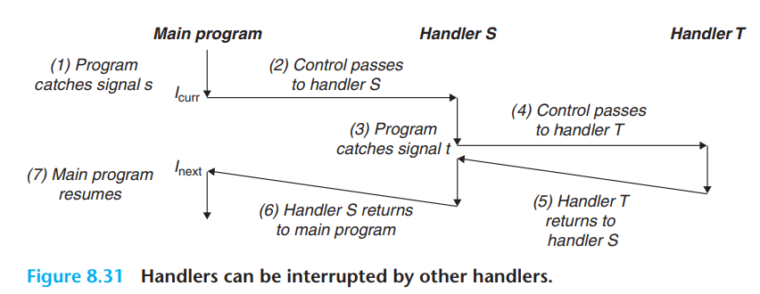

#### 单词学习记录：

| English       | Chinese                      |
| :------------ | ---------------------------- |
| occur on .... | 发生在 ... 上，作用于 ... 上 |
| occur in .... | 发生于...                    |

#### 信号机制

现在我们将学习更高级别的异常控制流的软件形式，被称为 ***Linux    Signal***，允许进程或者内核进程中断其他的进程。

***Linux signals***

| number             | name   | default action | corresponding event  |
| ------------------ | ------ | -------------- | -------------------- |
| 1                  | SIGHUP | Terminate      | Terminal line hangup |
| 。。。详情后续完善 |        |                |                      |
| 30                 | SIGPWR | Terminate      | Power failure        |

[man 7 signal]: http://man7.org/linux/man-pages/man7/signal.7.html

> ##### Signal Dispositions
>
> Each signal has a current disposition, which determines how the process behaves when it is delivered the signal.
>
> The entries in the "Action" column of the table below specify the default disposition for each signal, as follows:
> ```shell
> Term   Default action is to terminate the process.
> 
> Ign    Default action is to ignore the signal.
> 
> Core   Default action is to terminate the process and dump core (see
> core(5)).
> 
> Stop   Default action is to stop the process.
> 
> Cont   Default action is to continue the process if it is currently
> stopped.
> ```

> #### 译文
>
> ###### 信号处理
>
> 每个信号都有一个电流配置，决定了一个进程接收到这个信号时如何行动。
>
> 下面表中的Action列中的条目为每个信号指定了默认设置（见上文）

这个配置也是可以通过 *sigaction* 或 *signal* **System Call**  更改。使用 这些**System Call** 进程可以选择下面行为中的一个作用在传递来的信号上：a）默认行为 b) 忽略 c）程序员自定义处理 如 try...catch...

信号是一算很小的信息，通知一个进程系统中已经发生的某种类型的一个事件。每一个信号对应某种系统事件。低级的硬件异常被内核异常处理器处理，对用户不可见。信号提供了一种机制，使当前异常暴露于用户进程。

> 举个例子，当进程尝试 **除以0**时，内核就把**SIGFPE**发送个进程。

##### 信号技术

在两个明确的步骤中，信号被传递到目标进程：

- 发送信号：内核通过改变目标进程的上下文的一些状态将信号发送（传递）到目标进程。信号被传递有其中一个原因：
  - 内核侦测到系统的一些事件
  - 进程调用了 ***kill*** function
- 接收信号：当目标进程被内核迫使通过某种方式对递送来的信号做出反应时，目标进程就是接受了信号。目标进程可以 **忽略**、 **终止**、 或者 **捕获** 信号。

一个已经被发送，却还没有被接收的信号叫做 **pending signal**（悬信号，悬而未决的信号，待处理信号，下同）。在任何时候，一个类型的信号至多有一个 pending signal。多余的将被丢弃。进程可以有选择的阻塞接收确定的信号。

内核维护pending signal的集合，通过 **pending bit vector** 和 **blocked bit vector**。 当发送一个K类型的信号时，就设置pending bit vector的第k位，当这个信号被接收时，就消除设置。

##### 发送信号

Unix系统所有发送信号的机制，都依赖于， **process group** 这个概念，进程组的概念。

- ###### 进程组

  - 每个进程都属于一个明确的进程组，进程组有一个明确的，正整数ID，称之为**process group ID**通过 ***getpgrp*** 函数获取当前进程的进程组ID。
  - 子进程和父进程同属一个进程组，可以通过 *setpgid* 改变这一点

- ##### 通过 **/bin/kill** 程序发送信号

- ##### 通过键盘发送信号（如 Ctrl + C）

- ##### 通过调用*kill、alarm function*发送信号

  ```c
  int kill（pid_t pid, int sig）;
  unsigned int alarm(unsigned int secs);
  ```


##### 接收信号

当进程 p 从内核模式转为用户模式时，内核会检查进程 p 的非阻塞信号的集合。如果这个集合是空的，内核就会将控制传递给 p 进程的下一条指令。如果不是空的，内核就会强迫进程 p 接收信号 k （通常，k是最小的）。接收信号会触发进程的一些行动，行动完成后，控制权被传递给 p 进程的下一条指令。

> 注意，每种类型的信号都有默认的动作。这些默认的动作可以通过 *signal function* 改变，但是SIGSTOP和SIGKILL的默认行为不能被变更。

通过 [man 2 signal](man 7 signal http://man7.org/linux/man-pages/man7/signal.7.html )可查看该方法的api

当一个进程 p 捕获到 k 类型的信号时，会通过设置参数k，调用处理程序/处理器，这样，处理程序就会处理类型位k的信号。

当处理器执行它本身的 return 语句时，控制通常被传递给 p 被信号中断的指令。之所以说是 通常，那是因为一些系统回直接返回一个 error。




