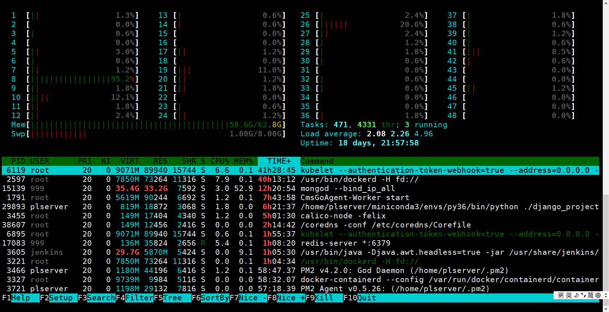

#### 前言

最近由于需要维护公司的服务器，其中这个htop命令经常用到。

- 第一眼： 挺规矩，应该不难懂
- 第二眼：懵逼
- 第三眼：what is fucking show

##### OK！ Let us look it up，and document it here.

#### htop在ubuntu server 18.04上呈现的样子



以上各项分别为：

- PID：进行的标识号
- USER：运行此进程的用户
- PRI：进程的优先级
- NI：进程的优先级别值，默认的为0，可以进行调整
- VIRT：进程占用的虚拟内存值
- RES：进程占用的物理内存值
- SHR：进程占用的共享内存值
- S：进程的运行状况，R表示正在运行、S表示休眠，等待唤醒、Z表示僵死状态
- %CPU：该进程占用的CPU使用率
- %MEM：该进程占用的物理内存和总内存的百分比
- TIME+：该进程启动后占用的总的CPU时间
- COMMAND：进程启动的启动命令名称

#### Uptime

显示系统运行了多长时间

你也可以使用 uptime 命令查看同样的信息

```shell
$ uptime
15:25:43 up 18 days, 22:00,  9 users,  load average: 2.57, 2.43, 4.55
```

**uptime** 读取 ***/proc/uptime*** 的内容，获取该信息

```shell
$ cat /proc/uptime
1634546.65 74447404.92
```

- 第一个值是 系统正常运行的时间长度
- 第二个值是 系统空闲的时间长度
- 第二个值可能大于多核系统上的整个系统正常运行时间，因为它是一个和

#### Load average

```shell
$ cat /proc/loadavg 
1.98 3.91 4.28 3/5267 5489
```

- 前三列表示最后1分钟、5分钟和15分钟期间的平均系统负载。
- 第四列显示当前正在运行的进程的数量和总数。
- 最后一列显示使用的最后一个进程ID。

> #### 我们先解释啥叫系统负载（又叫CPU负载）？
>
> 当我只有一个CPU且只有一个核心时（一核一线程），这是我运行了一个进程，那么这台机器的系统负载就是1，CPU的利用率就是 100%。这里我的CPU是48核的，最后一分钟的负载时1.98，即在最近过去的60s内，我平均使用1.98个CPU。这时CPU的利用率只有（1.98/48）*100% 。然而此时又有很多进程被挂起，那是因为我的这些进程大都是IO密集型的。在进行IO操作的时候CPU是不参与的。
>
> 与这点相关的一个重要概念是 **Process Time**，接下来有介绍

###### 让我们从最后一列开始讲解：

- 任何时候你新启动一个进程（process）都会被赋予一个新的pid（一个数字）
- PID通常是增加的，也有部分是被废弃后重新被利用的。
- PID=1是属于 `/sbin/init` 程序的。此程序在系统启动时运行

###### 再来看倒数第二列 

```shell
$ cat /proc/loadavg 
1.98 3.91 4.28 3/5267 5489
$ sleep 1 &
[1] 5490
```

通过以上结果，可以看出：

- 这里有**3**个进程在这个时间同时运行，一共有**5267**个进程。
- sleep程序不会增加正在 running process的数量。这是因为，running process是指正在物理CPU上操作的进程 or 正在等待轮到它在CPU上运行的进程。


#### 关于tasks

在htop界面的右面的角落里，有一个tasks。这里要说明一下，这里的task就是process，为啥不用process呢？我猜大概是作者为了节省屏幕的空间吧！***thr*** 表示线程数量。

你可以通过 shift + H 控制thr 显示/隐藏 ；shift + K 控制 ***kthr（内核线程）*** 显示/隐藏。


#### Process time

首先 **Ubuntu 18.04** 是一个多任务系统，啥意思呢，就是说，即使你的电脑只有一个核，你用这个系统看电影的同时，还可以用它运行爬虫程序。

大家都知道，一个核（一核一线程）在某一个确定的时间只能执行一个指令，为啥Ubuntu可以做到同时运行两个进程呢？因为 **Time Sharing**

就是说，一个进程运行一小段时间，然后 挂起，然后另一个程序运行一段时间。这个任务由系统负责完成。由于 时间分片 通常是毫秒级的，所以你感受不太明显。

当你只有一个CPU，而与此同时，你运行的程序又非常多的时候，Load-Average 就会超过1，这时你可能会感觉程序运行很慢，有时甚至让你觉得程序 “卡死”。这只是CPU太忙了而已。

> 注意 load average 的计算相当复杂的，详情请见：
>
> https://raw.githubusercontent.com/torvalds/linux/v4.8/kernel/sched/loadavg.c
>
> ```man
> /*
>  * kernel/sched/loadavg.c
>  *
>  * This file contains the magic bits required to compute the global loadavg
>  * figure. Its a silly number but people think its important. We go through
>  * great pains to make it work on big machines and tickless kernels.
>  */
> ```


