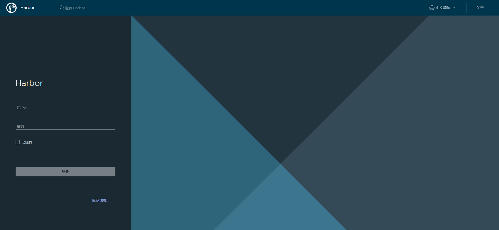

> 注意：在阅读本文之前需要先了解docker， docker hub等基本概念

### Harbor介绍（what is Harbor？）

Harbor是一个开源的容器镜像仓库（image registry，直译为镜像注册表，但我觉得**仓库**或许更合适，更形象），可以基于角色控制访问权限来保护镜像（images）安全，可以扫描镜像缺陷，以及将镜像标记为可信任。作为 **CNCF** 培育的项目，Harbor交付 在 合规性、性能和交互性三个指标上，帮助你跨云原生计算平台如 **Kubernetes** 和 **Docker** 持续、安全地管理镜像。

### Harbor 安装要求

- #### 硬件

  | 资源 | 最小配置 | 建议配置 |
  | ---- | -------- | -------- |
  | CPU  | 2 核     | 4 核     |
  | 内存 | 4 GB     | 8 GB     |
  | 硬盘 | 40 GB    | 160 GB   |

- #### 软件

  | 名称           | 版本                     | 描述                                                         |
  | -------------- | ------------------------ | ------------------------------------------------------------ |
  | Docker Engine  | 17.06.0-ce+ 或者更高版本 | 安装请看 官方文档 https://docs.docker.com/engine/installation/ |
  | Docker Compose | 1.18.0 +                 | 安装请看 官方文档 https://docs.docker.com/compose/install/   |
  | Openssl        | 最新的最好               | 用于为Harbor生成证书和密钥                                   |

- #### 端口要求

  | Port | Protocol | Description                                                  |
  | :--- | :------- | :----------------------------------------------------------- |
  | 443  | HTTPS    | Harbor portal and core API accept HTTPS requests on this port. You can change this port in the configuration file. |
  | 4443 | HTTPS    | Connections to the Docker Content Trust service for Harbor. Only required if Notary is enabled. You can change this port in the configuration file. |
  | 80   | HTTP     | Harbor portal and core API accept HTTP requests on this port. You can change this port in the configuration file. |

### 下载安装包

https://github.com/goharbor/harbor/releases，选一个符合你要求的安装，这里我选择的是：https://github.com/goharbor/harbor/releases/download/v2.0.0/harbor-offline-installer-v2.0.0.tgz

> 由于我国特色情况，这个直接下载不一定能成功，这里我将其保存在 **某盘** 中，链接获取方式是：
>
> 扫码关注，微信公众号：直截了当，  公众号内回复： harbor 即可获取此安装包，如果下载无碍请忽略
>
> .jpg)

### 解压安装包

如果你已经下载完成这个文件，那么你现在可以解压了。当然你也可以使用GPG验证一下这个tgz文件。验证方法如下

> 

OK，验证完成后解压此文件

```shell
(base) appsider@appsider-m:~/harbor_installation$ tar -xvf harbor-offline-installer-v2.0.0.tgz # 如果你使用我提供的安装包可以这么写，如果你使用自己下载的，需要将文件名变动一下，如果你要解压到没有权限操作的目录，需要在命令前 加 sudo
(base) appsider@appsider-m:~/harbor_installation$ ls
harbor  harbor-offline-installer-v2.0.0.tgz
```

### 创建证书

> 注意： 我这里实在本地虚拟机操作，所以直接使用ip作为域名，云服务器的化，需要配置域名

- #### 生成验证凭证

  ```shell
  $ openssl genrsa -out ca.key 4096
  Generating RSA private key, 4096 bit long modulus (2 primes)
  .........................................................++++
  ............++++
  e is 65537 (0x010001)
  $ openssl req -x509 -new -nodes -sha512 -days 3650 \
    -subj "/C=CN/ST=Beijing/L=Beijing/O=example/OU=Personal/CN=192.168.1.66" \
    -key ca.key \
    -out ca.crt
  $ ls
  ca.crt  ca.key  harbor  harbor-offline-installer-v2.0.0.tgz
  ```

  

最后生成 ca.crt、ca.key两个文件

- #### 生成服务器证书

  ```shell
  $ openssl genrsa -out 192.168.1.66.key 4096
  Generating RSA private key, 4096 bit long modulus (2 primes)
  .....++++
  .............................++++
  e is 65537 (0x010001)
  $ openssl req -sha512 -new \
      -subj "/C=CN/ST=Beijing/L=Beijing/O=example/OU=Personal/CN=192.168.166" \
      -key 192.168.1.66.key \
      -out 192.168.1.66.csr
  ```

  最终生成 192.168.1.66.csr  192.168.1.66.key 这两个文件

- 创建v3.ext文件

  ```shell
  $ cat > v3.ext <<-EOF
  authorityKeyIdentifier=keyid,issuer
  basicConstraints=CA:FALSE
  keyUsage = digitalSignature, nonRepudiation, keyEncipherment, dataEncipherment
  extendedKeyUsage = serverAuth
  subjectAltName = @alt_names
  
  [alt_names]
  DNS.1=192.168.1.66
  DNS.2=192.168.1.66
  DNS.3=192.168.1.66
  EOF
  
  # 使用v3.ext文件为您的harbor主机生成证书。
  $ openssl x509 -req -sha512 -days 3650 \
       -extfile v3.ext \
       -CA ca.crt -CAkey ca.key -CAcreateserial \
       -in 192.168.1.66.csr \
       -out 192.168.1.66.crt
  Signature ok
  subject=C = CN, ST = Beijing, L = Beijing, O = example, OU = Personal, CN = 192.168.1.66
  Getting CA Private Key
  ```

#### 提供证书给Harbor和Docker

```shell
# 将服务器证书和密钥复制到Harbor主机上的certficates文件夹中。
$ sudo mkdir -p /data/cert
$ sudo cp 192.168.1.66.crt /data/cert/
$ sudo cp 192.168.1.66.key /data/cert/
# 将192.168.1.66.crt转换为192.168.1.66.cert，以供Docker使用。
$ openssl x509 -inform PEM -in 192.168.1.66.crt -out 192.168.1.66.cert
# 将服务器证书，密钥和CA文件复制到Harbor主机上的Docker证书文件夹中。必须首先创建适当的文件夹。
$ sudo mkdir -p /etc/docker/certs.d/192.168.1.66/
$ sudo cp 192.168.1.66.cert /etc/docker/certs.d/192.168.1.66/
$ sudo cp 192.168.1.66.key /etc/docker/certs.d/192.168.1.66/
$ sudo cp ca.crt /etc/docker/certs.d/192.168.1.66/
# 重启docker service
$ systemctl restart docker # 也可以执行 sudo service docker restart
```

### 配置Harbor YML文件

```yaml
# 实例，这是一份官方给出的默认配置，这里我仅仅修改了域名 和证书文件地址

# 在解压文件夹 harbor 中 创建 harbor.yml,并按照一下示例配置你自己的 harbor.yml 文件

# **关于配置文件中的每个字段的意思我会单独讲解**

hostname: 192.168.1.66 # 你的域名
http:
  port: 80

https:
  port: 443
  certificate: /etc/docker/certs.d/192.168.1.66/192.168.1.66.cert # 你的cert保存的地址
  private_key: /etc/docker/certs.d/192.168.1.66/192.168.1.66.key  # 你的key保存的地址
harbor_admin_password: Harbor12345

database:
  password: root123
  max_idle_conns: 50
  max_open_conns: 100

data_volume: /data
clair:
  updaters_interval: 12
trivy:
  ignore_unfixed: false
  skip_update: false
  insecure: false

jobservice:
  max_job_workers: 10

notification:
  webhook_job_max_retry: 10
chart:
  absolute_url: disabled
log:
  level: info
  local:
    rotate_count: 50
    rotate_size: 200M
    location: /var/log/harbor
_version: 2.0.0
proxy:
  http_proxy:
  https_proxy:
  no_proxy:
  components:
    - core
    - jobservice
    - clair
    - trivy
```

#### 部署harbor

```shell
# 在解压文件夹 harbor 中存在 prepare 脚本 执行这个脚本,会自动pull部署过程中需要的images
$ ./prepare
Unable to find image 'goharbor/prepare:v2.0.0' locally
v2.0.0: Pulling from goharbor/prepare
836b6c765c93: Pull complete 
7d2118468cd6: Pull complete 
ec361edd3da3: Pull complete 
96018abb76c1: Pull complete 
93a6102d0a5d: Pull complete 
5ee1acfc0e3d: Pull complete 
2b88cfa69516: Pull complete 
5081e058f91e: Pull complete 
Digest: sha256:529596e839c481354f9652b3f598b0aa634c57015840d047295dc65a27ffd880
Status: Downloaded newer image for goharbor/prepare:v2.0.0
Generated configuration file: /config/log/logrotate.conf
Generated configuration file: /config/log/rsyslog_docker.conf
Generated configuration file: /config/nginx/nginx.conf
Generated configuration file: /config/core/env
Generated configuration file: /config/core/app.conf
Generated configuration file: /config/registry/config.yml
Generated configuration file: /config/registryctl/env
Generated configuration file: /config/registryctl/config.yml
Generated configuration file: /config/db/env
Generated configuration file: /config/jobservice/env
Generated configuration file: /config/jobservice/config.yml
loaded secret from file: /data/secret/keys/secretkey
Generated configuration file: /compose_location/docker-compose.yml
Clean up the input dir
# 执行 install 脚本, 同样在 harbor 文件夹内
$ sudo ./install.sh # 这可能需要花费一些时间
# 最后出现，表示成功
✔ ----Harbor has been installed and started successfully.----
```




打开域名你会看到这个页面，其默认用户名和密码是

```yaml
admin
Harbor12345 # 你再yaml文件中可以设置
```

> 注意：如果这台计算器之前有安装过harbor，而且没有清除挂载的话，那么用户名和密码可能会有不同