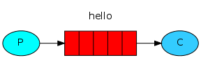

单词

| English            | Wiktionary | Chinese         |
| ------------------ | ---------- | --------------- |
| resource-intensive |            | 资源密集型      |
| time-consuming     |            | 耗时的          |
| encapsulate        |            | 封装            |
| eventual           |            | 最终的          |
| account for        |            | 占用；对...负责 |
| robin              |            | 知更鸟          |
| Round-robin        |            | 循环            |
| acknowledge        |            | 确认            |
| nowledgement       |            | 诺言            |
| dummy              |            | 假设            |
|                    |            |                 |
|                    |            |                 |
|                    |            |                 |
|                    |            |                 |


#### Introduction

RabbitMQ是消息中间人：它接收和传递消息。RabbitMQ和一般的消息中间人都用一些行话（术语）：

- **Producer**，发送消息的进程成为生产者
- **Queue**，你可以理解为RabbitMQ内部的邮箱。用来做消息缓冲。多个生产者可以向一个队列发送消息，多个消费者也可以从一个队列获取消息
- **Consumer**，消费/接收消息的进程称为消费者

#### Hello World



- 安装

  ```shell
  pip install pika --upgrade
  ```

- send.py

  ```python
  import pika
  connection = pika.BlockingConnection(pika.ConnectionParameters('localhost')) # 初始化/建立连接（establish a connection）
  channel = connection.channel()
  channel.queue_declare(queue='hello') # 声明hello队列
  ```

  这样就准备好一个队列了，我们可以发送消息了现在。

  但是RabbitMQ不会把消息直接发送到队列，队列需要经过一个交换机（交换所，原文作exchange，这个exchange到底有啥用呢？[了解更多传送门]()），我们现在所要知道的是由 空字符串 标识的默认exchange。这个exchange允许我们明确指定消息应该被推送到哪个队列中。使用`routing_key`参数指定

  ```python
  channel.basic_publish(exchange='',
                        routing_key='hello',
                        body='Hello World!')
  print(" [x] Sent 'Hello World!'")
  # 在我们退出程序之前，我们需要确认网络缓冲区被刷新并且我们的消息被准确地递交给rabbitmq
  connection.close()
  ```
  
  > 提醒：如果rabbit可用磁盘空间少于200M，会拒绝消息
  
  **send.py**
  
  ```python
  #!/usr/bin/env python
  import pika
  
  connection = pika.BlockingConnection(
      pika.ConnectionParameters(host='localhost'))
  channel = connection.channel()
  
  channel.queue_declare(queue='hello')
  
  channel.basic_publish(exchange='', routing_key='hello', body='Hello World!')
  print(" [x] Sent 'Hello World!'")
  connection.close()
  ```
  
  

- receiv.py

  ```python
  # 我们不能确认send和receive这两个程序哪个先运行，所以这里要再声明一次队列
  channel.queue_declare(queue='hello')
  # 接收消息比较复杂，通过向队列订阅一个 回调 函数工作。任何时候 callback 函数都会被 Pika 库调用。
  def callback(ch, method, properties, body):
      print(" [x] Received %r" % body)
  
  # 接下来我们要告诉RabbitMQ这是一个特殊地 callback 函数，这个函数需要接收 hello 队列的消息。注意这里需要确认 此队列存在，这也是我们需要在 send 和 receive 两个程序中都声明该 队列的原因
  channel.basic_consume(queue='hello',
                        auto_ack=True,
                        on_message_callback=callback)
  ```

  这里 `auto_ack`参数为`true`时，关闭手动信息确认。通常情况下，这个参数默认为`false`，也就是说我们通常情况下需要[手动确认信息](https://www.rabbitmq.com/confirms.html)。手动确认信息后面的内容专门讨论，所以这里我们选择关闭。

  ```python
  # 最后我们进入一个无限循环，等待数据并且在有必要的时候调用callback 函数
  print(' [*] Waiting for messages. To exit press CTRL+C')
  channel.start_consuming()
  ```

  **receive.py**

  ```python
  #!/usr/bin/env python
  import pika
  
  connection = pika.BlockingConnection(
      pika.ConnectionParameters(host='localhost'))
  channel = connection.channel()
  
  channel.queue_declare(queue='hello')
  
  
  def callback(ch, method, properties, body):
      print(" [x] Received %r" % body)
  
  
  channel.basic_consume(queue='hello', on_message_callback=callback, auto_ack=True)
  print(' [*] Waiting for messages. To exit press CTRL+C')
  channel.start_consuming()
  ```
  
  

  ### Work Queues

  我们这一节将创建一个队列，将耗时的任务分配给多个workers
  
  ##### round-robin
  
  每个worker得到一样多的任务，这种分发任务的方式称为 round-robin
  
  ##### Message acknowledgment
  
  当一个任务被分发给一个woker A后，这个任务被标记准备删除掉。但是此时，如果你杀死了woker A，或者因为某种原因，woker A挂掉了。那么这个消息/任务就被丢掉了，但我们不希望丢失任何任务。
  
  如果woker A挂掉了，我们希望woker B执行这项任务。
  
  为了实现这一点，RabbitMQ引入了 **message acknowledgments**。
  
  如果一个任务被充分执行了，那么woker将回给RabbitMQ一个ack，如果没有那么RabbitMQ就默认没有充分执行，那么任务将会再次进入队列。
  
  将`auto_ack=True`修改为`auto_ack=false(默认情况)`即可
  
  ```python
  # receive.py
  def callback(ch, method, properties, body):
      print(" [x] Received %r" % body)
      time.sleep( body.count('.') )
      print(" [x] Done")
      ch.basic_ack(delivery_tag = method.delivery_tag) # 回信/回执
  
  channel.basic_consume(queue='hello', on_message_callback=callback, auto_ack=false)
  ```
  
  > 如果忘记 basic_ack，后果很严重。RabbitMQ会内存溢出。你可以使用 rabbitmqtl
  
  ##### Message Durability
  
  确保队列及其中的数据在RabbitMQ节点重启后依旧存在，需要在生产者和消费者两方的代码里都确认。
  
  ```python
  channel.queue_declare(queue='hello', durable=True)
  channel.basic_publish(exchange='',
                        routing_key="task_queue",
                        body=message,
                        properties=pika.BasicProperties(
                           delivery_mode = 2, # make message persistent
                        ))
  ```
  
  > 值得注意的是，Message Durability 并不能确保所有的message都被写入硬盘，也就是说它并强壮。如需保证message一定被写入硬盘，请参考 **piblisher confirms**
  
  ##### fair dispatch
  
  ```python
  channel.basic_qos(prefetch_count=1) # 告诉RabbitMQ不要将一个新的消息分发给workerA，直到workerA处理完它手头上的任务。
  ```
  
  ##### 将这些代码整合起来
  
  `new_task.py`
  
  ```python
  #!/usr/bin/env python
  import pika
  import sys
  
  connection = pika.BlockingConnection(
      pika.ConnectionParameters(host='localhost'))
  channel = connection.channel()
  
  channel.queue_declare(queue='task_queue', durable=True)
  
  message = ' '.join(sys.argv[1:]) or "Hello World!"
  channel.basic_publish(
      exchange='',
      routing_key='task_queue',
      body=message,
      properties=pika.BasicProperties(
          delivery_mode=2,  # make message persistent
      ))
  print(" [x] Sent %r" % message)
  connection.close()
  ```
  
  `worker.py`
  
  ```python
  #!/usr/bin/env python
  import pika
  import time
  
  connection = pika.BlockingConnection(
      pika.ConnectionParameters(host='localhost'))
  channel = connection.channel()
  
  channel.queue_declare(queue='task_queue', durable=True)
  print(' [*] Waiting for messages. To exit press CTRL+C')
  
  
  def callback(ch, method, properties, body):
      print(" [x] Received %r" % body)
      time.sleep(body.count(b'.'))
      print(" [x] Done")
      ch.basic_ack(delivery_tag=method.delivery_tag)
  
  
  channel.basic_qos(prefetch_count=1)
  channel.basic_consume(queue='task_queue', on_message_callback=callback)
  
  channel.start_consuming()
  ```
  
  #### Publish/Subscribe
  
  有时候我们需要将一个message分发给多个worker，这种模式叫做 **Publish/Subscribe**
  
  ##### Exchages
  
  生产者并不直接将message发送到queue，而是发送到Exchage，由Exchange决定message的去除。Exchange有**direct, topic, headers 和 fanout**四种模式，我们重点研究第四个——**fanout**
  
  ```python
  channel.exchange_declare(exchange='logs', exchange_type='fanout')
  ```
  
  

