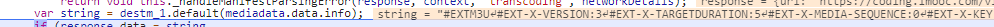

今天讲一下下载某视频网站视频的一般手法（这里我就不说那个网站的视频了，大家了解一下基本思路即可）

#### M3U8简介

**#EXT-X-KEY**  表示对media segments进行解码 

**IV（Initialization Vector）**,则使用序列号作为IV进行编解码，将序列号的高位赋到16个字节的buffer中，左边补0；如果有IV，则将该值当成16个字节的16进制数。

故我们拿到 key 和 iv 即可将加了密的m3u8文件中的每一个视频片段都下载下来并且转换为非加密形式

#### 老看此网站的加密m3u8


#### No. 1 查看获取以上数据发送请求的方法的调用栈


#### No. 2 调用栈中应该引起你注意的地方

- load
- trigger
- parsed
- success
- 。。。

等，熟悉前端的同学应该知道，请求返回后一般回进行数据的处理（如 解密，格式化等操作）。一般会在load或success里。当然还有其他，具体看网站。

#### 断点调试，获取加密数据解析代码

果不其然，稍加调试就获取该网站的解密函数



其具体代码为

```js
function n(t, e) {
    function r(t, e) {
        var r = "";
        if ("object" == typeof t)
            for (var n = 0; n < t.length; n++)
                r += String.fromCharCode(t[n]);
        t = r || t;
        for (var i, o, a = new Uint8Array(t.length), s = e.length, n = 0; n < t.length; n++)
            o = n % s,
            i = t[n],
            i = i.toString().charCodeAt(0),
            a[n] = i ^ e.charCodeAt(o);
        return a
    }
    function n(t) {
        var e = "";
        if ("object" == typeof t)
            for (var r = 0; r < t.length; r++)
                e += String.fromCharCode(t[r]);
        t = e || t;
        var n = new Uint8Array(t.length);
        for (r = 0; r < t.length; r++)
            n[r] = t[r].toString().charCodeAt(0);
        var i, o, r = 0;
        for (r = 0; r < n.length; r++)
            0 != (i = n[r] % 3) && r + i < n.length && (o = n[r + 1],
            n[r + 1] = n[r + i],
            n[r + i] = o,
            r = r + i + 1);
        return n
    }
    function i(t) {
        var e = "";
        if ("object" == typeof t)
            for (var r = 0; r < t.length; r++)
                e += String.fromCharCode(t[r]);
        t = e || t;
        var n = new Uint8Array(t.length);
        for (r = 0; r < t.length; r++)
            n[r] = t[r].toString().charCodeAt(0);
        var r = 0
          , i = 0
          , o = 0
          , a = 0;
        for (r = 0; r < n.length; r++)
            o = n[r] % 2,
            o && r++,
            a++;
        var s = new Uint8Array(a);
        for (r = 0; r < n.length; r++)
            o = n[r] % 2,
            s[i++] = o ? n[r++] : n[r];
        return s
    }
    function o(t, e) {
        var r = 0
          , n = 0
          , i = 0
          , o = 0
          , a = "";
        if ("object" == typeof t)
            for (var r = 0; r < t.length; r++)
                a += String.fromCharCode(t[r]);
        t = a || t;
        var s = new Uint8Array(t.length);
        for (r = 0; r < t.length; r++)
            s[r] = t[r].toString().charCodeAt(0);
        for (r = 0; r < t.length; r++)
            if (0 != (o = s[r] % 5) && 1 != o && r + o < s.length && (i = s[r + 1],
            n = r + 2,
            s[r + 1] = s[r + o],
            s[o + r] = i,
            (r = r + o + 1) - 2 > n))
                for (; n < r - 2; n++)
                    s[n] = s[n] ^ e.charCodeAt(n % e.length);
        for (r = 0; r < t.length; r++)
            s[r] = s[r] ^ e.charCodeAt(r % e.length);
        return s
    }
    for (var a = {
        data: {
            info: t
        }
    }, s = {
        q: r,
        h: n,
        m: i,
        k: o
    }, l = a.data.info, u = l.substring(l.length - 4).split(""), c = 0; c < u.length; c++)
        u[c] = u[c].toString().charCodeAt(0) % 4;
    u.reverse();
    for (var d = [], c = 0; c < u.length; c++)
        d.push(l.substring(u[c] + 1, u[c] + 2)),
        l = l.substring(0, u[c] + 1) + l.substring(u[c] + 2);
    a.data.encrypt_table = d,
    a.data.key_table = [];
    for (var c in a.data.encrypt_table)
        "q" != a.data.encrypt_table[c] && "k" != a.data.encrypt_table[c] || (a.data.key_table.push(l.substring(l.length - 12)),
        l = l.substring(0, l.length - 12));
    a.data.key_table.reverse(),
    a.data.info = l;
    var f = new Array(-1,-1,-1,-1,-1,-1,-1,-1,-1,-1,-1,-1,-1,-1,-1,-1,-1,-1,-1,-1,-1,-1,-1,-1,-1,-1,-1,-1,-1,-1,-1,-1,-1,-1,-1,-1,-1,-1,-1,-1,-1,-1,-1,62,-1,-1,-1,63,52,53,54,55,56,57,58,59,60,61,-1,-1,-1,-1,-1,-1,-1,0,1,2,3,4,5,6,7,8,9,10,11,12,13,14,15,16,17,18,19,20,21,22,23,24,25,-1,-1,-1,-1,-1,-1,26,27,28,29,30,31,32,33,34,35,36,37,38,39,40,41,42,43,44,45,46,47,48,49,50,51,-1,-1,-1,-1,-1);
    a.data.info = function(t) {
        var e, r, n, i, o, a, s;
        for (a = t.length,
        o = 0,
        s = ""; o < a; ) {
            do {
                e = f[255 & t.charCodeAt(o++)]
            } while (o < a && -1 == e);if (-1 == e)
                break;
            do {
                r = f[255 & t.charCodeAt(o++)]
            } while (o < a && -1 == r);if (-1 == r)
                break;
            s += String.fromCharCode(e << 2 | (48 & r) >> 4);
            do {
                if (61 == (n = 255 & t.charCodeAt(o++)))
                    return s;
                n = f[n]
            } while (o < a && -1 == n);if (-1 == n)
                break;
            s += String.fromCharCode((15 & r) << 4 | (60 & n) >> 2);
            do {
                if (61 == (i = 255 & t.charCodeAt(o++)))
                    return s;
                i = f[i]
            } while (o < a && -1 == i);if (-1 == i)
                break;
            s += String.fromCharCode((3 & n) << 6 | i)
        }
        return s
    }(a.data.info);
    for (var c in a.data.encrypt_table) {
        var h = a.data.encrypt_table[c];
        if ("q" == h || "k" == h) {
            var p = a.data.key_table.pop();
            a.data.info = s[a.data.encrypt_table[c]](a.data.info, p)
        } else
            a.data.info = s[a.data.encrypt_table[c]](a.data.info)
    }
    if (e)
        return a.data.info;
    var g = "";
    for (c = 0; c < a.data.info.length; c++)
        g += String.fromCharCode(a.data.info[c]);
    return g
}
```

将以上加密数据，使用此函数n解析得到


#### 此时信心慢慢使用ffmpeg下载视频

What！！！竟然报错了，key竟然不对

将解析出的m3u8中的URI放到浏览器中打开，得到


此时，我断定这里的info就是key，只不过也是加密的key。

so，此key怎么解密。你可以重复上述手段再来一次，也可以像我一样根据经验大胆猜测一番。

嘿嘿，我猜测，解密还是使用这个函数n。

最后经测试得出解析play list的时候和解析key稍有不同

- 解析play list时，参数e为undefined
- 解析key时，你可以为e赋个“真”值，如 e=1

最后得到的key是这样的


那么此时我们有了key 和 playlist 进度已经由80%了

#### 对key处理一下

现在我们需要把key（Uint8Array）保存到一个文件中，我也不太会哟！我就去google了一下。还真找到了 nodejs版本

```js
ƒ savekey(arr) {
  const key = new Uint8Array(arr);
  fs.writeFile('./m3u8.key', u8a, () => {
    console.log('OK');
  });
}
# arr即上面处理得到的二进制数组
```

ok有了key，那么我们从新编辑一下m3u8文件

```
#EXTM3U
#EXT-X-VERSION:3
#EXT-X-TARGETDURATION:5
#EXT-X-MEDIA-SEQUENCE:0
#EXT-X-KEY:METHOD=AES-128,URI="./key.key"
#EXTINF:5.000000,
https://{ts文件路径}.ts
.
.
.
#EXT-X-ENDLIST
```

ok接下来你就可以使用ffmpeg下载，也可以使用VLC播放器播放了


## 这里指一般视频网站加密破解思路，仅供学习交流。如有雷同纯属巧合。如强行硬套，浪费时间本文概不负责。同时也欢迎大家私信交流，wxId： abigtree123

