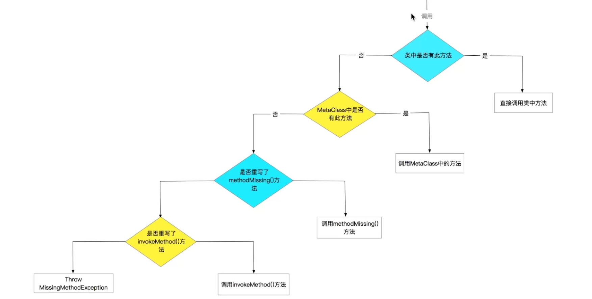
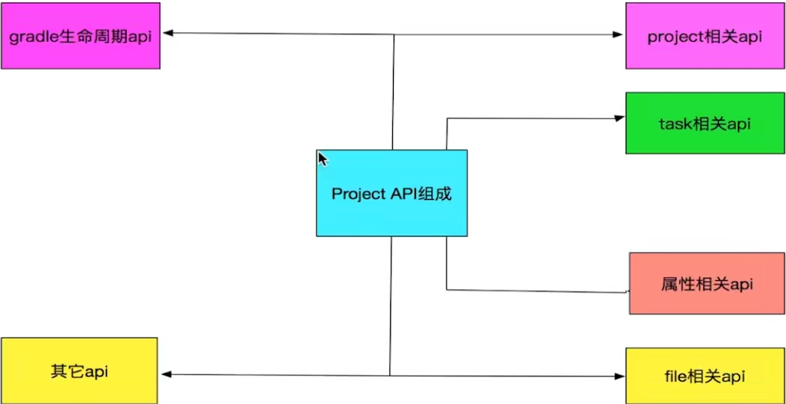

#### 面向对象

> 注意事项
>
> - 接口中不能定义非public的方法

groovy对象方法调用



##### 动态添加属性/方法

```groovy
class Person{
    
}

Person.metaClass.name_ = null //动态添加属性，注意 name是个关键字，在groovy闭包中指向当前类名

Person.metaClass.nameUpperCase = {return name_.toUpperCase()}
def person = new Person(name_: 'neo', age: 26)
println(person.nameUpperCase())
// neo: 36
// NEO
```

#### groovy文件处理

- 读
- 写

#### gradle project

- 核心api

  

```gradle
apply from : '{gradle file}'
```

在build.gradle中通过ext扩展属性，子project会继承父project的属性

#### 依赖dependencies

- 依赖分为项目依赖 和  buildScript 脚本依赖

#### task执行顺序


